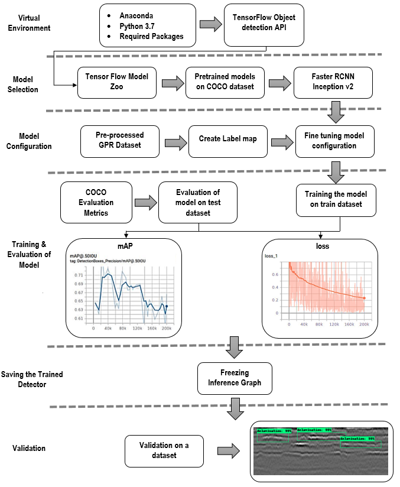
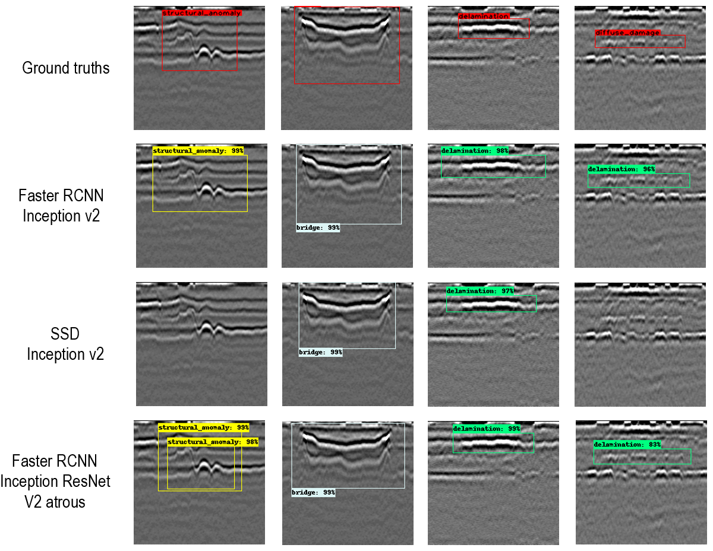
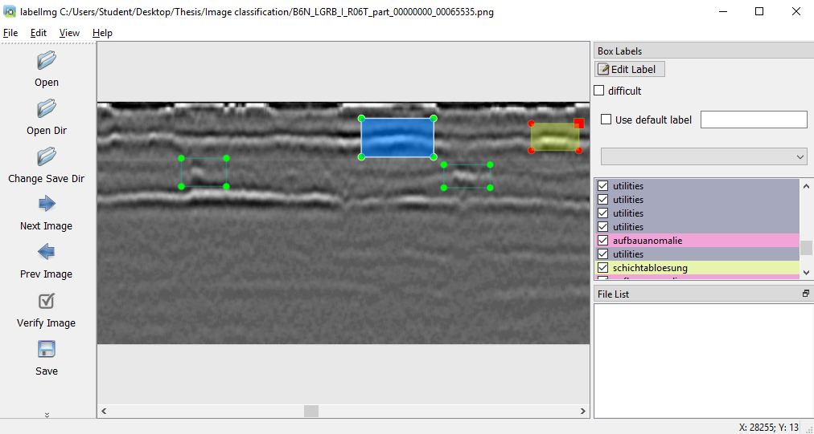
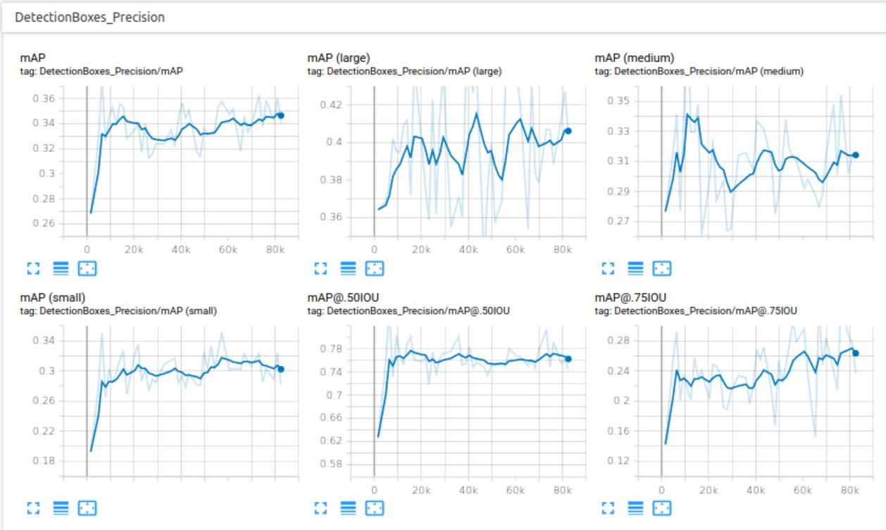

# Tutorial to train a custom object detector using bounding boxes on Tensorlfow 1.15 and evaluation of mAP on Linux OS as well as Windows 10

This repository is a tutorial to train an object detection classifier on your own dataset using the Tensorflow pre-trained models. Until 12th July 2020, the Tensorflow Object detction API supports on tensorflow version 1.15 (NOW API IS UPDATED TO TENSORFLOW VERSION 2) and this repository has scripts dedicated for Tensorflow version 1.15. The commands are specified for Ubuntu 16 OS and alternative commands for Windows 10 are also specified.

## Preface

These scripts were created for my master thesis on "Subsurface road damage and feature detection based on GPR measurements and deep learning models." Please cite my thesis report incase if you use the images with Bibtex:
```
@MastersThesis{salimkhan_GPR_OD_2020,
    author     =     {Salimkhan Pathan},
    title     =     {Subsurface damage detection based on GPR measurements and deep learning models},
    school     =     {University of Kaiserslautern},
    address     =     {Germany},
    year     =     {2020},
    }
```

The methodology is explained in the following figure:

<p align="center">
  
</p>

This methodology was examined on various models in order to find a robust model to serve the main purpose of this thesis. Besides the detection accuracy, the computing speed of the trained detector is also an important aspect of comparison. The single-stage models, such as SSD and YOLO offer higher model speed along with an effective mAP. Whereas there are models with very low model speed, such as Faster RCNN NasNet and Faster RCNN Inception ResNet v2 atrous, but have high precision.The following image shows an example of results on various models:

<p align="center">
  
</p>

This selection of model depends on the computing speed of the machine and also the dataset being used. Since the GPR measurements had very small objects to be detected, Faster RCNN Inception v2 model was found to be efficient and hence this tutorial fine-tunes the Faster RCNN Inception model. However, one can follow similar steps for other models.

I will soon upload a video to follow the tutorial.

## Steps to train your own object detector:

1. [INSTALL ANACONDA, CUDA, CuDNN](https://github.com/khany27/object_detection#1-INSTALL-ANACONDA-CUDA-CuDNN)
2. [Download TensorFlow Object Detection API](https://github.com/khany27/object_detection#2-Download-TensorFlow-Object-Detection-API)
3. [Selection of a model from TensorFlow's model zoo](https://github.com/khany27/object_detection#3-Selection-of-a-model-from-TensorFlow's-model-zoo)
4. [Download the required scripts from this repository](https://github.com/khany27/object_detection#4-Download-the-required-scripts-from-this-repository)
5. [Creating a virtual environment and installing tensorflow](https://github.com/khany27/object_detection#5-Creating-a-virtual-environment-and-installing-tensorflow)
6. [Installing required libraries](https://github.com/khany27/object_detection#6-Installing-required-libraries)
7. [Compiling the Protobufs and installing the Object detection API](https://github.com/khany27/object_detection#7-Compiling-the-Protobufs-and-installing-the-Object-detection-API)
8. [Generating the training dataset](https://github.com/khany27/object_detection#8-Generating-the-training-dataset)
9. [Configuring the training](https://github.com/khany27/object_detection#9-Configuring-the-training)
10. [Training and evaluation of the model](https://github.com/khany27/object_detection#10-Training-and-evaluation-of-the-model)
11. [Freezing and exporting Inference graph](https://github.com/khany27/object_detection#11-Freezing-and-exporting-Inference-graph)
12. [Validation of the trained detector](https://github.com/khany27/object_detection#12-Validation-of-the-trained-detector)

### 1. INSTALL ANACONDA, CUDA, CuDNN

For the machine with a GPU, we will be working with TensorFlow 1.15, which is comaptible with CUDA 10.0, Python 3.3 - 3.7 and CuDNN 7.4. 

If you are using an older version of TensorFlow, make sure you use the CUDA and cuDNN versions that are compatible with the TensorFlow version you are using. [Here](https://www.tensorflow.org/install/source#tested_build_configurations) is a table showing which version of TensorFlow requires which versions of CUDA and cuDNN.

If the machine does not contain a GPU, we will just install Python 3.3 - 3.7 and neglect CUDA and CuDNN installation.


### 2. Download TensorFlow Object Detection API

The TensorFlow Object Detection API is an open source framework, offered by Google Brain team, developed on platform of TensorFlow, making it simple to create, train, and deploy models for object detection.

Download the full TensorFlow object detection API repository located at https://github.com/tensorflow/models by clicking the “Clone or Download” button and downloading the zip file.

Create a directory for the project, for example "C:/tensorflow_project", and paste the folder 'models'. PLEASE NOTE THE PATH OF THE DIRECTORY. The location of the directory is important for the upcoming commands.  

Open the downloaded zip file and extract the “models-master” folder directly into the directory you created for the project. Rename “models-master” to just “models”.

NOTE: I have create a folder named tensorflow1 in my home directory. so CHANGE the path to directory '/home/pathan/tensorflow1' to YOUR DIRECTORY which conatins the models folder by 'Find and Replace' in the scripts when required.


### 3. Selection of a model from TensorFlow's model zoo

TensorFlow provides various pre-trained object detection models for various datasets such as COCO, KITTI, ImageNET etc. These models can be found on [model zoo](https://github.com/tensorflow/models/blob/master/research/object_detection/g3doc/tf1_detection_zoo.md).

This tutorial employs Faster RCNN Inception v2 model which was pretrained on COCO dataset. One can also use other models from the Tensorflow model zoo and it needs to be fine-tuned.

Download the model here: http://download.tensorflow.org/models/object_detection/faster_rcnn_inception_v2_coco_2018_01_28.tar.gz

Extract the faster_rcnn_inception_v2_coco_2018_01_28 folder to the \models\research\object_detection folder.


### 4. Download the required scripts from this repository

This turtorial comprises of various scripts from different repositories and have been edited for personal application. 

Make sure the generate_tfrecords.py, xml_to_csv.py and the training folder are downloaded.

Paste the contents of the folder in the /models/research/object_detection directory.


### 5. Creating a virtual environment and installing tensorflow

Anaconda, a open-source distribution of the Python widely used for scientific computing, is used to create set of packages for distribution in all its dependencies. It offers creation of virtual environments to isolate the projects, which may require different libraries with different versions. For example, a program runs a specific old version of libraries and it expects a certain behavior that is present in older version of libraries but it changes in newer versions. To avoid this conflict, a virtual environment is created for installing the specific version of libraries and programming language.

If the machine comprises of a GPU, we will  install tensorflow-gpu. The most easiest approach would be to install it with its required libraries directly. For instance, a virtual environment named ’TF’ is created by following command from Anaconda prompt:
```
conda create --name TF tensorflow-gpu==1.15
```
This creates and virtual environment named tensorflow1 with tensorflow-gpu along with some required libraries. If the machine doesn't have aGPU, we can install tensorflow by following command:
```
conda create --name TF tensorflow==1.15
```

This virtual environment can be activated by command:
```
conda activate TF
```

### 6. Installing required libraries

Once the virtual environment is activated, TensorFlow and the required libraries can be installed. Following dependencies were installed using pip command:
```
conda install -c anaconda protobuf
pip install pillow
pip install lxml
pip install Cython
pip install contextlib2
pip install jupyter
pip install matplotlib
pip install pandas
pip install opencv-python
pip install numpy
```
Further, PYTHONPATH must be defined before using TensorFlow Object Detection API. We set the PYTHONPATH to the \models, \models\research, and \models\research\slim directories. Following command is used to direct python to additional required packages and modules that are required for the execution of TensorFlow Object Detection API:

```
set PYTHONPATH=C:\tensorflow_project\models;C:\tensorflow_project\models\research;C:\tensorflow_project\models\research\slim    #CHANGE THE PATH ACCORDING TO YOUR DIRECTORY
```

For linux, type the following command:
```
export PYTHONPATH="/home/pathan/tensorflow1/models:/home/pathan/tensorflow1/models/research:/home/pathan/tensorflow1/models/research/slim:$PYTHONPATH"   #CHANGE THE PATH ACCORDING TO YOUR DIRECTORY
```
To check if the PYTHONPATH is set correctly, type the following command (for Windows):
```
echo %PYTHONPATH%
```

### 7. Compiling Protobufs and installing the Object detection API

The Tensorflow Object Detection API utilizes the Protobufs (Protocol Buffers) to configure the model, its training and evaluation process. The protobufs are generally cross-platform and cross-language libraries used to serialize the structured data efficiently. The protocol messages are represented by .proto files, which are easier to understand a message type. There are various protobuf files for different purposes. For example, Pipeline.proto is one of the important protobuf files which describes the schema for training pipeline.

As specified on the Tensorflow Object detection API repository, the pipeline.proto shows that the standard structure of the configuration file is divided into mainly five parts:
1. model configuration: It defines the type of model that will be trained, for example the meta-architecture and the feature extractor of the model.
2. train_config configuration: It decides the parameters used to train model such as input preprocessing and initialization values of feature extractor.
3. eval_config configuration: It determines the set of metrics used to evaluate the detection results on test dataset. For this thesis, the metrics was configured to COCO evaluation metrics.
4. train_input_config configuration: It represents the dataset on which the model is to be trained, i.e. training dataset.
5. eval_input_config configuration: It defines the dataset on which the model is to be evaluated, i.e. the testing dataset.

Other protobufs includes various methods for data augmentation and adjusting the parameters such as the non-max suppression threshold value. The files with extension .proto need to be converted to .py extesnion. This can be complied by changing directory to the folder /models/research by command:

```
cd C:/tensorflow_project/models/research
protoc --python_out=. .\object_detection\protos\FILENAME.proto
```

Here, FILENAME is the name of files with extension .proto. The following code will compile all the proto files to .py altogether from the working directory /models/research:

```
protoc --python_out=. .\object_detection\protos\anchor_generator.proto .\object_detection\protos\argmax_matcher.proto .\object_detection\protos\bipartite_matcher.proto .\object_detection\protos\box_coder.proto .\object_detection\protos\box_predictor.proto .\object_detection\protos\eval.proto .\object_detection\protos\faster_rcnn.proto .\object_detection\protos\faster_rcnn_box_coder.proto .\object_detection\protos\grid_anchor_generator.proto .\object_detection\protos\hyperparams.proto .\object_detection\protos\image_resizer.proto .\object_detection\protos\input_reader.proto .\object_detection\protos\losses.proto .\object_detection\protos\matcher.proto .\object_detection\protos\mean_stddev_box_coder.proto .\object_detection\protos\model.proto .\object_detection\protos\optimizer.proto .\object_detection\protos\pipeline.proto .\object_detection\protos\post_processing.proto .\object_detection\protos\preprocessor.proto .\object_detection\protos\region_similarity_calculator.proto .\object_detection\protos\square_box_coder.proto .\object_detection\protos\ssd.proto .\object_detection\protos\ssd_anchor_generator.proto .\object_detection\protos\string_int_label_map.proto .\object_detection\protos\train.proto .\object_detection\protos\keypoint_box_coder.proto .\object_detection\protos\multiscale_anchor_generator.proto .\object_detection\protos\graph_rewriter.proto .\object_detection\protos\calibration.proto .\object_detection\protos\flexible_grid_anchor_generator.proto
```
This creates a name_pb2.py file from every name.proto file in the \object_detection\protos folder.

Now, build and install Tesnorflow Object detection API from setup.py. From the models\research directory as working directory, type the following commands:
```
python setup.py build
python setup.py install
```
Now, the virtual environment is ready to run the trained detector or make a dataset and train the model with the new dataset.


### 8. Generating the training dataset

Collect all the images which contain the objects. Typical count of images to train the model is to be in thousands. In the /object_detection/images directory, create two folders, one for train and other for test. In these folder the images that are to be trained and tested are pasted. Normally, the ratio is kept as 80% for training and 20% for testing.

#### 8a. Labelling the objects in the images

After distributing the images, the spatial locations of the objects in the image are to be annotated . There are various annotation tools available such as `VoTT´ and `LabelImg´. For this tutorial, [LabelImg](https://github.com/tzutalin/labelImg), an open source software used for labelling the objects in the image, is used. As illustrated in the screenshot below, many rectangular bounding boxes were annotated as the spatial location of the damage in the image along with different categories. Once the labels have been assigned to the dataset, in the form of XML file format, the information of these labels about the image coordinates was extracted.

<p align="center">
  
</p>

After downloading and installing LabelImg, open the file labelimg.py in anaconda with working directory as the folder where this file is saved by command:
```
python labelimg.py
```
In LabelImg tool open the train directory and later test directory to access the images in the folder. Create bounding boxes as labels for the objects in the images. LabelImg will create XML files of the labels for each image. Label objects for all images in the test and train directory.

Now, we convert all the XML files into a CSV file for test and train folder. For this the script form this repository xml_to_csv.py is to be run which will convert all xml files in train and test folder to a csv file 'train_labels.csv' and 'test_labels.csv' respectively.

```
python xml_to_csv.py
```

#### 8b. Generating TFRecords

The TFRecord is a format using to store a sequence of binary records in Tensorflow. As binary data requires less space on the disk, it is easy to compute, copy and read the data in less time. In order to read data efficiently, it is serialize and stored in a set of files to be read linearly. Similarly, TFRecord is a file format containing serialized binary data that includes information of both the images and their annotations which are used for training and testing the model.

The TfRecords are generated from the 'train_labels.csv' and 'test_labels.csv' files. The script generate_tfrecords.py will generate TFRecords, train.record and train.record from the CSV files. However, the script generate_tfrecords.py is to be configured by adding the categories that are annotated in the images. For instance, if you have categories labelled as 'apple', 'banana', 'strawberry', 'mango' and 'grapes', you congifure the script as follows:

```
def class_text_to_int(row_label):
    if row_label == 'apple':
        return 1
    elif row_label == 'banana':
        return 2
    elif row_label == 'strawberry':
        return 3
    elif row_label == 'mango':
        return 4
    elif row_label == 'grapes':
        return 5
    else:
        None
```

You can add more categories by adding the labels further. It is important that the IDs of the categories are to be noted down for creating a label map later.

Once, the script is configured, the following commands with the working directory as /models/research/ object_detection will generate the CSV files and the  TFRecords:

```
python generate_tfrecord.py --csv_input=images/train_labels.csv --image_dir=images/train --output_path=train.record
python generate_tfrecord.py --csv_input=images/test_labels.csv --image_dir=images/test --output_path=test.record
```
#### 8c. Creating a Label map:

The label map maps an ID number to a class. The ID numbers were assigned to the category in a similar sequence as in TFRecords. This label map assists model in learning the class of the objects. A file 'labelmap.pbtxt' is written in a text editor and saved in the /object_detection/training directory. Label map is written in format as follows:

```
item {
  id: 1
  name: 'apple'
}

item {
  id: 2
  name: 'banana'
}

item {
  id: 3
  name: 'strawberry'
}

item {
  id: 4
  name: 'mango'
}

item {
  id: 5
  name: 'grapes'
}
```

### 9. Configuring the training

In order to start training the model, we configure the pipeline config file in the training folder and also install COCO evaluation metrics to evaluate the model during the training process.

#### 9a. Installing COCO evaluation metrics

An evaluation metrics is necessary to evaluate the mAP of the model. As computed in the section above in eval_config configuration, the evaluation metrics is set to COCO Evaluation metrics. This is installed from [COCO API](https://github.com/cocodataset/cocoapi).

COCO API can be installed through the following commands in sequence:

```
mkdir /models/research/object_detection/cocoapi

cd /models/research/object_detection/cocoapi

git clone https://github.com/cocodataset/cocoapi.git 

cd  /models/research/object_detection/cocoapi/PythonAPI

make
```

#### 9b. Fine-tuning the model configuration

 The config file is divided into 5 parts. Each part of the configuration file consists of configuration required for various operations such as feature extraction, input image dimension, parameters of the architecture, evaluation metrics, etc. The skeleton of the configuration file is shown below:

```
model :{
(Model configuration are included here)
}

train_config : {
(Training configuration are included here)
}

train_input_reader: {
(Parameter for the training dataset are included here)
}

eval_config: {
(evaluation metrics are configured here)
}

eval_input_reader: {
(Parameters for the testing dataset are included here)
}
```

[TensorFlow Model Zoo](https://github.com/tensorflow/models/blob/master/research/object_detection/g3doc/detection_model_zoo.md) consists of various pre-trained models and the desired model has its configuration pipeline arranged in the above mentioned skeleton. We will use the config file from the /object_detection/samples/configs directory. Copy the faster_rcnn_inception_v2_pets.config file into the /object_detection/training directory.

Using a text editor, Faster RCNN Inception v2 configuration file is fine tuned as follows:

In model configuration:
```
num_examples: 5 	#Total number of classes in the dataset 
```

In train\_config configuration:
```
fine_tune_checkpoint: "faster_rcnn_inception_v2_coco_2018_01_28/model.ckpt"		 #Path to directory of the model
```

In train\_input\_reader configuration:
```
input_path: "train.record"		#path to train.record
label_map_path: "label_map.pbtxt"	#path to label_map.pbtxt
```
  
In eval\_config configuration:
```
metrics_set: "coco_detection_metrics"
num_examples: 100		#number of images in test dataset
num_visualizations: 100		#number of images in test dataset
```

In eval\_input\_reader configuration:
```
input_path: "test.record" 		#path to test.record
label_map_path: "label_map.pbtxt	#path to label_map.pbtxt
```

### 10. Training and evaluation of the model

Once the model pipeline is configured and evaluation metrics is installed, the model can be trained through the script model_main.py along with model evaluation through following command:

```
python model_main.py --pipeline_config_path=training/faster_rcnn_inception_v2_coco.config --model_dir=training --eval_training_data=true --alsologtostderr
```

The training should be stopped by pressing ctrl+C, if the loss is stagnant around 0.1 loss value. However, the config file is configured to train up to 200k steps and it be changed by editing the config file.

Along with calculation of loss in the training phase of the model, the mAP is also determined simultaneously on the test dataset. The scalar graphs of such evaluation can be accessed through TensorBoard. It provides the visualization and tracking of metrics such as loss and accuracy. It is accessed by the following command:

```
tensorboard --logdir=training
```

<p align="center">
  
</p>

### 11. Freezing and exporting Inference graph

During training, millions of parameters are computed over every image and millions of gradients are computed to perform backward propagation. These are the adjusted weights and gradients through the training which are to stored and frozen. Freezing is the process of identifying and saving all necessary parameters such as graph in a single file that can be accessed easily. So the final step was to freeze the graph and export it in order to be used further.

After the training is interrupted or completed, the training directory consists of 5 type of files: 

1. model.ckpt.meta: The file .ckpt.meta includes the complete graph. It includes GraphDef, SaverDef, and so on.
2. model.ckpt.data: It contains the values of variables such as weights, biases, placeholders, gradients, hyper-parameters, etc.
3. model.ckpt.index:  It is a table where each key has the name of a particular tensor and its value is a serialized BundleEntryProto.
4. checkpoint: It is used to continue the training and evaluation further if interrupted.
5. graph.pbtxt: It is the data of the parameter and it will be frozen to inference graph with extension .pb.

The inference graph can be frozen and exported by the following command:

```
python export_inference_graph.py --input_type image_tensor --pipeline_config_path training/faster_rcnn_inception_v2_coco.config --trained_checkpoint_prefix training/model.ckpt-200000 --output_directory inference_graph
```

Here, the '200000' is the highest number of steps achieved after the training. It should be replaced with the highest numbered of model.ckpt file in the training directory. The inference graph will be stored as frozen_inference_graph.pb in the /object_detection/inference_graph directory.

### 12. Validation of the trained detector

After exporting the inference graph, the trained detector is now ready to be tested on a validation dataset. It can be deployed on images as well as videos through the available scripts on the repository. These scripts were edited from the repository [Edje Electronics](https://github.com/EdjeElectronics/TensorFlow-Object-Detection-API-Tutorial-Train-Multiple-Objects-Windows-10).

Since my project had plenty of images, a directory was created, /object_detection/images/check, where the validation dataset was pasted and an another directory, /object_detection/images/check_results, where the results from the trained detector were generated. Paste your images on which you wish to detect the objects in the check directory. NOTE: If you create your own directory, please edit the script.

The following command will test the trained detector on the validation dataset with multiple images:

```
python Object_detection.py
```

## Trouble shooting errors

This section will be edited soon. Please feel free to contact me on ersalim02@gmail.com. Thank you. Have fun!
